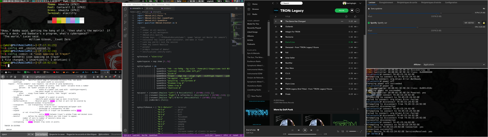

# DotFiles

This is a bare git repo for my dot files, just like DT explained here: https://youtu.be/tBoLDpTWVOM. Thanks DT!

## XMonad

### Left screen:
  - Reflected ResizableTall layout (renamed "Right" because the master window is on the right side)
  - XMobar with transparent background and XBM icons
  - Trayer:
    * pamac-tray
    * cbatticon
    * nm-applet
    * pasystray
    * blueman-tray
  - My XMonad config in Visual Studio Code with the Atom Dark theme. Not Atom One Dark, Atom Dark.
  - Fish shell in Alacritty terminal
    * transparent background thanks to picom compositor
    * neofetch
    * fortune -a
    * the config alias in action, as explained by DT (see above)
  - Trayer readme.md in Firefox
  
### Right screen:
  - ResizableTall layout
  - Spotify
  - pavucontrol
  - fish with bluetoothctl connected to my Sony WF-XB700 earphones (I'm still figuring out how to deal with my bluetooth adapter. Looks like I've got to power cycle it after reboot I think)

## Lots more to do!

You can see in the screenshot that I've got lots more stuff to do before calling it done...
