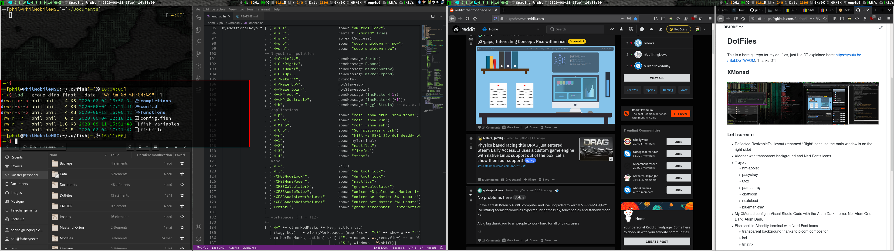

# DotFiles

This is a bare git repo for my dot files, just like DT explained here: https://youtu.be/tBoLDpTWVOM. Thanks DT!

## XMonad

### Left screen:
  - Reflected ResizableTall layout (renamed "Right" because the main window is on the right side)
  - XMobar with transparent background and Nerf Fonts icons
  - Trayer:
    * nm-applet
    * pasystray
    * utox
    * pamac-tray
    * cbatticon
    * nextcloud
    * blueman-tray
  - My XMonad config in Visual Studio Code with the Atom Dark theme. Not Atom One Dark, Atom Dark.
  - Fish shell in Alacritty terminal with Nerd Font icons
    * transparent background thanks to picom compositor
    * lsd
    * tmatrix
  
### Right screen:
  - ResizableTall layout (renamed left because the main window in on the left side)
  - Reddit in Firefox
  - Another Terminal
    * neofetch
    * fortune -a
